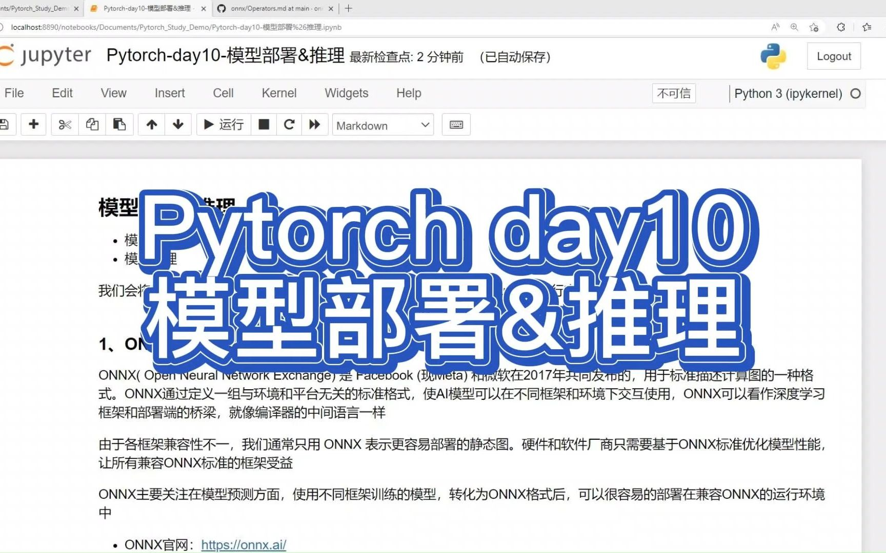
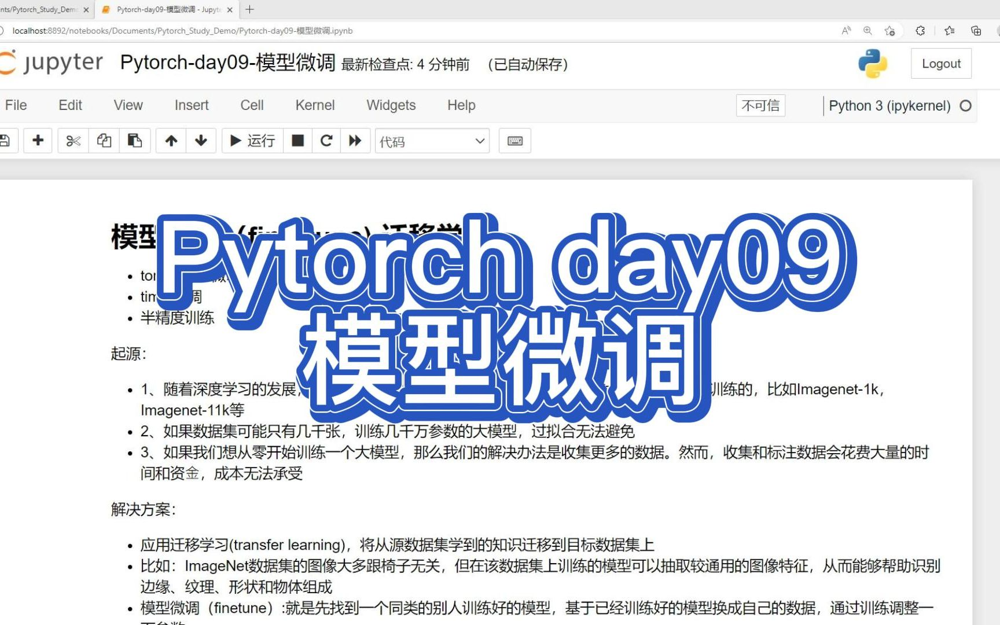
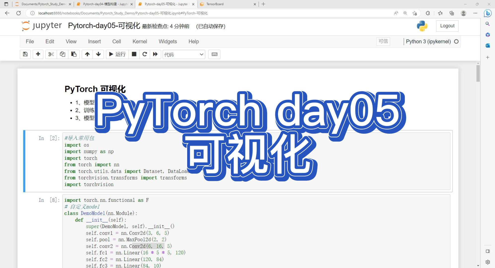

# Pytorch_Study教程

LetsAskAI(AI助手）：http://www.aiadvice.top/

特点：

- 1、一个国内可以访问、使用的大语言模型平台2、首次注册，免费尝鲜国内顺畅体验GPT、文心一言等AI大模型。
- 2、Python、Java、Matlab、前端页面编码开发
- 3、论文改进思路
- 4、AI 海报设计，广告文案生成
- 5、头条、抖音口播文案生成
- 6、可提供对外 API 服务
- 使用场景：https://w1l3qi32ze.feishu.cn/wiki/A3DSwMUr0i54YVkKWrQcunGhnef

项目介绍：https://github.com/ExpressGit/LetAsKAI

官网地址：https://www.aiexplorer.blog/
- AI在线体验站点（最新）
- AI能力私有化部署指南
- 深度学习算法原理讲解
- Pytorch深度学习算法开发教程

## Pytorch教程视频录制

| 日期 | 标题 | 封面 | 时长 | 视频（播放数） |
| --: | -- | -- | --: | -- |
| 4/14/23 | PyTorch10天入门-10-模型部署&推理 |  | 20:00 | |
| 4/11/23 | PyTorch10天入门-09-模型微调 |  | 14:28 | |
| 4/09/23 | PyTorch10天入门-08-模型进阶训练技巧 |  | 14:02 | |
| 4/08/23 | PyTorch10天入门-07-模型保存与读取 |  | 11:24 | |
| 4/06/23 | PyTorch10天入门-06-复杂模型构建 |  | 17:26 | |
| 4/05/23 | PyTorch10天入门-05-可视化 |  | 10:50 | |
| 4/03/23 | PyTorch10天入门-04-模型构建 |  | 08:17 | |
| 4/02/23 | PyTorch10天入门-03-数据读取 |  | 10:34 | |
| 3/27/23 | PyTorch10天入门-02-自动求导 |  | 09:25 | |
| 3/25/23 | PyTorch10天入门-01-基础知识 |  | 06:16 |  |

---

技术交流
--
目前群主部署了ChatGPT的在线版本，星球的朋友可以先体验，不想加星球的，可以晚一点白嫖～

群主会不定期发布 各类亮眼项目体验版本 供大家体验，星球主要沉淀一些商业AI最新讯息，帮助大家节约时间。欢迎各位读者老爷，漂亮姐姐给我的项目点赞！

|              关注微信号               |                      知识星球                       |
|:-------------------------------:|:-----------------------------------------------:|
|  |   |

加群前先看： 

- 1 实时分享新的 AI 动态
- 2 球友共享 AI 资源
- 3 分享 AI 私有化部署和使用方法
- 4 进星球免费赠送 chatgpt 账号一个
- 5 想通过群里推广卖号代充的不用进了
---

